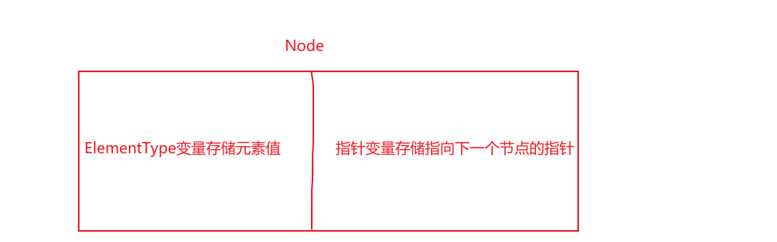
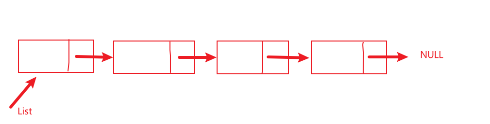
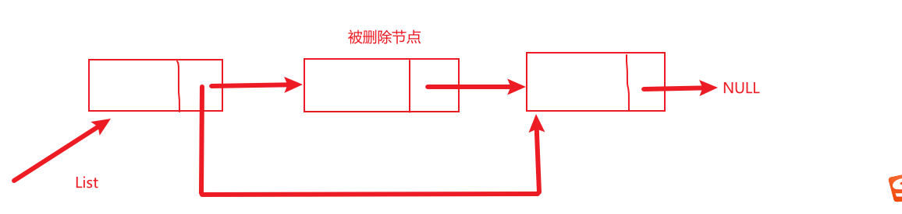
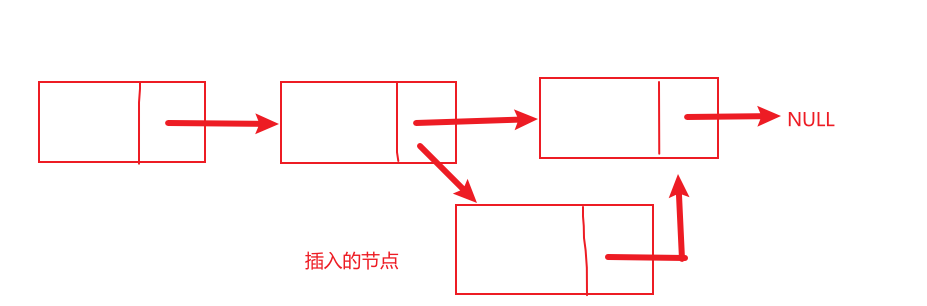
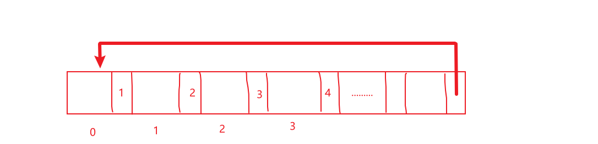
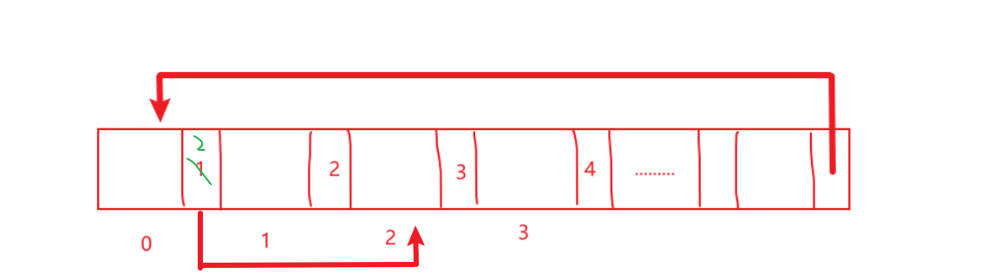
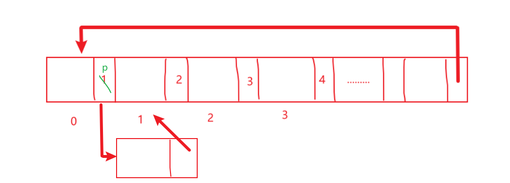

### Chapter  Three

#### 1.链表（指针实现）

数组是在内存中一片连续的空间存储数据的。如果开辟一个比较大的数组，那么就需要一片较大的内存空间才行。而链表则不需要一片连续的空间，它可以利用好琐碎的小空间，然后再用指针将它们一个一个串起来，从而合理利用好空间。

链表的关键在于结构体和指针的使用。

（1）节点和指针的定义

```C
/*
先定义一个结构体变量，结构体中，一个是存储元素值，一个是存储指向下一个节点的指针。
然后利用typedef，将结构体变量struct Node改名为Node。
*/
typedef struct Node{
	ElementType Element;
	Node* Next;
}Node;
```



```C
typedef Node* List; //指向链表（表头）的指针定义
typedef Node* Position; //指向普通节点的指针定义
```

一般书写链表时，都习惯去写带有头结点的链表。因为加上头结点，会使一些操作书写起来更方便。比如说：如果是没有头结点的链表，删除第一个节点，就会改变List指针的指向。同样在第一个位置插入节点，也会改变其指针指向。这样操作会很麻烦；相比之下，带上头结点之后，删除和插入这些操作实现起来，逻辑就会很清晰。

整体上，链表就像他的名字一样，它的存储结构就像一个链子，除了头结点之外，每个结点中存储上对应的值，然后指针指向下一个节点，“环环相扣”！



#### 插入一个小知识：

阐述一下数据结构中的逻辑结构和存储结构。

==逻辑结构==：是针对问题抽象出来的数学模型，独立于计算机。

**可以分为线性结构、非线性结构。**

线性结构：有且仅有一个开始节点、一个结束节点。所有的节点最多有一个直接前驱和一个直接后继。

例如：链表、栈、队列、串

非线性结构：有可能有多个前驱和多个后继

例如：树、图

==存储结构==：与计算机相关，是存储在计算机中的实实在在的存储形式。

**可以分为**

**1.顺序存储结构**

**2.链式存储结构**

一个逻辑结构，既可以用顺序结构来实现，也可以用链式存储结构来实现。比如：栈、队列既可以用顺序结构（数组）来实现，也可以用链式结构（指针）来实现。


（2）链表的系列操作

```C
//创建一个带有头结点的链表
//头结点中不存储元素值
List makeEmpty()
{
	//头结点 
	List L=(Node*)malloc(sizeof(Node));
	L->Next=NULL;
	return L;	
}
```

```c
//判断一个链表是不是空表
bool IsEmpty(List L)
{
	if(L->Next==NULL)//证明这个链表只有头结点
	{
		return true;	
	}
	else
	{
		return false;	
	}	
}
```

```C
//判断一个节点是不是最后一个节点
bool IsLast(Position P)
{
	if(P->Next==NULL)
	{
		return true;
	}
	else
	{
		return false;
	}
}
```

```c
//查找元素值对应的那个地址，请返回指针
Position Find(ElementType x,List L)
{
	Position p=L->Next;
	while(p!=NULL&&p->Element!=x)
	{
		p=p->Next;
	}
	return p;
}
```

**关键操作之删除**



```c
//查找指定元素值的上一个节点 
Position  FindPrevious(int x,List L)
{
	Position p=L;
	while(p->Next!=NULL&&p->Next->Element!=x)
	{
		p=p->Next;
	}
	return p;
}
```

```C
//删除指定元素值所在的节点
bool Delete(ElementType x,List L)
{
	Position  FindPrevious(int x,List L);
	Position p=FindPrevious(x,L);
	Position term;
	if(!IsLast(p))
	{
		term=p->Next;
		p->Next=term->Next;	
		free(term);
	}
	return true;		
}
```

**关键操作之插入**



```c
//在指定节点p后面，插入元素x 
void Insert(ElementType x,List L,Position p)
{
	Position h=(Position)malloc(sizeof(Node));
	h->Element=x;
	
	h->Next=p->Next;
	p->Next=h;	
} 
```

#### 2.多项式的运算

关键之处在于多项式的定义。用一个指向结构体变量的指针来表示一个多项式。

定义一个系数的数组，数组索引下标表示X的几次幂，数组中存储的值表示该项的系数。

另外定义一个变量表示一个多项式的最高次幂是多少。

```C
typedef struct Node{
	int CoeffArray[MaxDegree+1]; //用数组来存储多项式系数，从系数0到系数100 
	int HighPower;      //多项式的最高次项系数 
}* Polynomial;
```

==相关操作==

（1）清空多项式

```C
//清空多项式
/*
将多项式的X的0到100次幂的系数全部置为0
也将最高次幂置为0
*/
void ZeroPolynomial(Polynomial Poly)
{
	for(int i=0;i<=MaxDegree;i++)
	{
		Poly->CoeffArray[i]=0;
	}
	Poly->HighPower=0;	
} 
```

（2）两个多项式的加法

```c
//两个多项式的加法
void AddPolynomial(Polynomial Poly1,Polynomial Poly2,Polynomial PolySum)
{
	//清空多项式PolySum
	ZeroPolynomial(PolySum); 
	//先求两个多项式加和之后的，最高次幂
	PolySum->HighPower=Max(Poly1->HighPower,Poly2->HighPower);
	//各项进行加和
	for(int i=0;i<=PolySum->HighPower;i++)
	{
		PolySum->CoeffArray[i]=Poly1->CoeffArray[i]+Poly2->CoeffArray[i];	
	}	
} 
```

（3）两个多项式的乘法

```c
//两个多项式的乘法
void MultPolynomial(Polynomial Poly1,Polynomial Poly2,Polynomial PolyProd)
{
	//清空多项式
	ZeroPolynomial(PolyProd);
	//乘积之后的最高次幂
	PolyProd->HighPower=Poly1->HighPower+Poly2->HighPower;
	//判断是否溢出
	if(PolyProd->HighPower>MaxDegree) 
	{
		Error("内存空间溢出!\n");
	}
	else
	{
		for(int i=0;i<=Poly1->HighPower;i++)
		{
			for(int j=0;j<=Poly2->HighPower;j++)
			{
				PolyProd->CoeffArray[i+j]+=Poly1->CoeffArray[i]*Poly2->CoeffArray[j];
			}
		}
	}
}
```

（4）打印多项式

```c
//打印多项式
void PrintPoly(Polynomial Q)
{
	for(int i=Q->HighPower;i>0;i--)
	{
		printf("%dX^%d+",Q->CoeffArray[i],i);	
	}
	printf("%d\n",Q->CoeffArray[0]);	
}
```

#### 3.链表（游标实现）

在许多其他编程语言中，没有指针这个东西。那怎么实现链表呐？用游标来模拟指针，所谓的游标就是一个数字，这个数字指向了下一个节点的位置（数组下标），如果没有了只指针，那么也就不能用malloc来分配内存空间了，也不能用free来释放空间。那么就得用CursorSpace[SpaceSize]数组模拟内存空间，用自定义的CursorAlloc函数模拟malloc函数，用CursorFree函数模拟free函数。

**相关操作**

（1）结构定义

```C
struct Node{
	ElementType Element;
	Position Next;
};
```

```c
typedef int ElementType;
#define SpaceSize 100
typedef int PtrToNode;
typedef PtrToNode List;     //指向链表的游标
typedef PtrToNode Position; //指向节点的游标 
```

```C
//模拟内存空间
struct Node CursorSpace[SpaceSize];
```

（2）初始化内存空间

```C
//初始化游标，用游标来模拟指针！ 
void InitializeCursorSpace()
{
	for(int i=0;i<SpaceSize;i++)
	{
		CursorSpace[i].Next=i+1; 
	}
	CursorSpace[SpaceSize-1].Next=0; 
}
```

Next域中的数字相当于指针，0相当于NULL；

现在的内存空间变成了这样：




（3）模拟malloc函数，其实就是将CursorSpace数组中索引为1的空间分配出去。

相当于在表头进行了删除操作。如图：




（4）模拟free函数，其实就是将这个空间再放回到数组中，相当于在头部进行了插入操作。



（5）创建一个空表

```c
//创建一个空表
List MakeEmpty()
{
	List L=CursorAlloc();
	CursorSpace[L].Next=0;
	return L;			
}
```

（6）查找指定元素

```c
//在链表中查找指定元素
Position Find(ElementType X,List L)
{
	Position p=CursorSpace[L].Next;//第一个节点
	while(p!=0&&CursorSpace[p].Element!=X)
	{
		p=CursorSpace[p].Next;	
	}
	return p;	
}
```

（7）关键操作之删除

```C
//通过元素值，查找上一个元素
Position FindPrevious(ElementType X,List L)
{
	Position p=L;
	while(CursorSpace[p].Next!=0&&CursorSpace[CursorSpace[p].Next].Element!=X)
	{
		p=CursorSpace[p].Next;
	}
	return p;	
}
```

```c
//在链表中删除指定元素
void Delete(ElementType X,List L)
{
	//函数声明 
	Position FindPrevious(ElementType X,List L); 
	Position p=FindPrevious(X,L);
	Position term;
	if(!IsLast(p))
	{
		term=CursorSpace[p].Next;
		CursorSpace[p].Next=CursorSpace[term].Next;
		CursorFree(term);	
	}	
}
```

（8）插入操作

```c
//在指定位置后插入 
void Insert(Position p,ElementType X,List L)
{
	Position y=CursorAlloc();
	CursorSpace[y].Element=X;
	CursorSpace[y].Next=CursorSpace[p].Next;
	CursorSpace[p].Next=y;
}
```

#### 4.栈（指针实现）

用指针实现栈，非常类似于链表的指针实现。区别之处在于操作不同。对于栈而言，最重要的操作就是入栈和出栈操作了。入栈相当于在链表的头部进行插入，而出栈相当于在链表的头部进行删除。这样就完美地满足了栈LIFO的特性。

（1）结构体定义

```c
struct Node{
	ElementType Element;
	struct Node* Next;	
};

typedef struct Node* PtrToNode;//普通节点
typedef PtrToNode Stack;//栈
```

（2）压栈操作

```c
//压栈操作
void Push(ElementType X,Stack S)
{
	//其实就是在栈顶，头结点处进行插入操作 
	PtrToNode p=(PtrToNode)malloc(sizeof(struct Node));	
	p->Element=X;
	p->Next=S->Next;
	S->Next=p;
}
```

（3）出栈操作

```c
//出栈操作（弹出）
void Pop(Stack S)
{
	PtrToNode p=S->Next;
	if(p==NULL)
	{
		printf("该栈为空栈!\n");	
	}
	else
	{
		S->Next=p->Next;
		free(p);	
	}		
}
```

#### 5.栈（数组实现）

就像上面复习的一样，同一种逻辑结构，比如说栈的逻辑结构是线性的，可以使用不同的存储结构。

可以像4中的一样，使用链式存储结构，用指针；也可以使用顺序存储结构，用数组。

栈的数组实现，关键在于数据结构的定义。

```c
struct StackRecord{
	int Capacity;  //自己定义的栈大小 
	int TopOfStack;  //相当于栈顶游标
	ElementType* Array;//指向int的指针类型 
};
```

```c
//用指向结构体变量的指针表示一个栈
typedef struct StackRecord* Stack;
```

设置一个栈顶指针，入栈的时候，++，出栈的时候--,正好可以满足LIFO的特性。

关键操作之压栈。

```c
//压栈
void Push(ElementType X,Stack S)
{
	if(IsFull(S))
	{
		printf("栈已将满了!\n");	
	}
	else
	{
		S->TopOfStack++;
		S->Array[S->TopOfStack]=X;
	}	
} 
```

关键操作之出栈

只是移动了栈顶指针，相当于“假删除”，在物理存储空间依然存在，但是并不影响。下一次压栈的时候，就会覆盖掉。

```C
//出栈(弹出)
void Pop(Stack S)
{
	if(IsEmpty(S))
	{
		printf("该栈为空!\n");	
	}
	S->TopOfStack--;		
}
```

##### 6.队列（数组实现）

队列的指针实现：队列的指针实现非常类似链表的指针实现。特殊之处在于，入队和出队操作。入队相当于在链表的表尾进行插入，而出队相当于在表头进行删除。具体实现so easy

队列的数组实现：队列的数组实现，关键在于结构的定义。设置一个队头游标，一个队尾游标。从而满足FIFO的特性。

(1)数据结构的定义

```c
struct QueueRecord{
	int Capacity;//开辟数组容量 
	int Front;
	int Rear;
	int Size;//实际容量 
	ElementType* Array;
};
```

```c
typedef struct QueueRecord* Queue;//将结构体指针变量名改名为了Queue
```

(2)关键操作之移动指针

这个函数用来移动队头和队尾指针，当移动到队尾时，再次移动时，返回队头。

```c
//这个函数的作用是：移动队尾指针 
int Succ(int Value,Queue Q)
{
	if(++Value==Q->Capacity)
	{
		Value=0;
	}
	return Value;
}
```

关键操作之入队

```c
//入队
void EnQueue(ElementType X,Queue Q)
{
	if(IsFull(Q))
	{
		printf("队列已经满了!\n");
		exit(0);	
	}
	else
	{
		Q->Size++;
		Q->Rear=Succ(Q->Rear,Q);
		Q->Array[Q->Rear]=X;	
	}	
}
```

关键操作之出队

```c
//出队
void DeQueue(Queue Q)
{
	if(IsEmpty(Q))
	{
		printf("该队列是空队列!\n");	
	}
	else
	{
		Q->Size--;
		Q->Front=Succ(Q->Front,Q);	
	}	
} 
```

移动队头指针即可，做了一个“假删除”，但并不影响。之后的入队会进行覆盖！