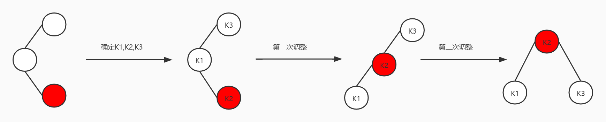

### Chapter Four

#### 1.二叉搜索树

树是一种重要的数据结构，它可以有多个后继。

二叉搜索树首先是一棵二叉树，就是一个节点最多有两个分支。另外，二叉搜索树还具有一个特性：对于每一个节点都是，左子树上的值均小于该节点的值，右子树上的值均大于该节点上的值。

##### （1）数据结构的定义

```c
typedef int ElementType;
struct TreeNode{
	ElementType Element;
	struct Node* Left;
	struct Node* Right;
};

typedef struct TreeNode* Position;//指的是普通节点
typedef struct TreeNode* SearchTree;//指的是二叉搜索树 
```

##### （2）清空一棵二叉搜索树

```c
SearchTree MakeEmpty(SearchTree T)
{
	if(T!=NULL)
	{
		MakeEmpty(T->Left);
		MakeEmpty(T->Right);
		free(T);	
	}
	return NULL;
}
```

##### （3）查找某个值在二叉树的哪个位置

原理就是：借助二叉搜索树的特性，比节点值大的话，递归去搜索右子树；比节点值小的话，递归去搜索左子树。递归结束条件是找到对应节点，或者是直接指空了。

```c
Position Find(ElementType X,SearchTree T)
{
	if(T==NULL)
	{
		return NULL;	
	}
	else
	{
		if(X<T->Element)
		{
			return Find(X,T->Left);
		}
		if(X>T->Element)
		{
			return Find(X,T->Right);
		}
		if(X==T->Element)
		{
			return T;	
		}	
	}		
} 
```

##### （4）寻找二叉搜索树中的最小值（递归的思路）

同样利用二叉搜索树的特性，往左一直递归查找，最左侧的叶子节点便是这棵二叉搜索树的最小值。

```c
//递归找最小值
Position FindMin(SearchTree T)
{
	if(T==NULL)
	{
		return NULL;
	}
	else if(T->Left==NULL)
	{
		return T;
	}
	else
	{
		return FindMin(T->Left);
	}
} 
```

##### （5）寻找二叉搜索树中的最大值（循环的思路）

```c
Position FindMax(SearchTree T)
{
	if(T!=NULL)
	{
		while(T->Right!=NULL)
		{
			T=T->Right;
		}
	}
	return T;
} 
```

##### （6）关键操作之插入

具体思路：

如果这棵树一开始就是空的，那就建立树根节点，然后左子树为NULL，右子树为NULL；现将这棵树建立起来。

如果一开始树不为空，那必有节点，那节点里面也必有值啊！为满足二叉搜索树的特性。插入的值比节点值小，那么就左侧递归插入。如果插入的值比节点值大，那么就右侧递归插入。如果正好等于节点的值，什么也不做！

```c
//向二叉搜索树中插入一个值X
SearchTree Insert(ElementType X,SearchTree T)
{
	if(T==NULL)
	{
		T=(Position)malloc(sizeof(struct TreeNode));
		T->Element=X;
		T->Left=NULL;
		T->Right=NULL;	
	}
	else
	{
		if(X<T->Element)
		{
//			return Insert(X,T->Left);
//			我知道为什么要这么写了！因为这样才能连成一棵树啊！！！！
			T->Left=Insert(X,T->Left);	 
		}
		else
		{
			T->Right=Insert(X,T->Right);	
		}	
	}
	//如果这个值已经在树中了，那就啥也操作，直接返回T 
	return T;	
} 
```

##### （7）关键操作之删除一个值

思路：首先是递归地去查找，先找到这个值再进行删除的操作。

如果找不见，那就是树里面没有节点是这个值。

如果找到了，那就考虑这个节点的左右子树是否都有？这个节点只有左子树？这个节点只有右子树？

这个节点本身就是叶子节点？

因为情况不同，那么操作也肯定不相同！

1）==有左右子树==：在这种情况下，我们删除这个节点的话，应该考虑删除了它之后的树，是否还是满足二叉搜索树的特性。

**小妙招来了：**寻找被删除节点的右子树中的最小值。让这个值去替换被删除节点中的值，这样能够保持二叉搜索树的特性。然后再递归地删除右子树中最小值节点。做到“偷天换日”，删除了另一个值的真实指针，让其值替换了真正被删除的节点！

2）==只有一棵子树==:

只有左子树：一个节点如果只有左子树，那么它的右子树肯定是指向为NULL，删除它之后还要保持它的子树在啊！所以，先将T保存在临时变量中，T=T->Left,让被删除节点的父节点指向它的右子树，从而保证删除了被删除节点，而且保持不变。

只有右子树，也是同样的理解。将T先保存在临时变量中，然后T=T->Right;

最后将将保存在临时变量中的指针，free掉。

3）==一棵子树也没有，是个叶子节点==。直接free掉。

```c
//在二叉搜索树中删除一个值
SearchTree Delete(ElementType X,SearchTree T)
{
	Position temp;
	if(T==NULL)
	{
		printf("没有找到!\n");
	}
	else if(X<T->Element)
	{
		T->Left=Delete(X,T->Left);
	}
	else if(X>T->Element)
	{
		T->Right=Delete(X,T->Right);
	}
	else if(T->Left&&T->Right)
	{
		temp=FindMin(T->Right);
		T->Element=temp->Element;
		T->Right=Delete(T->Element,T->Right);
	}
	else
	{
		temp=T;
		if(T->Left==NULL)
		{
			T=T->Right;
		}
		else if(T->Right==NULL)
		{
			T=T->Left;
		}
		free(temp);
	}
	return T;
	
	
}
```


##### （8）获取一个节点的值

```c
//取一个节点中的值
ElementType Retrieve(Position P)
{
	return P->Element;	
}
```

#### 2.AVL树

##### （1）基本概念

AVL树的命名是用两个人名的首字母拼起来命名的。这个了解就好。AVL树指的是平衡二叉查找树。

==问题来了，什么是平衡呐？==

答：就是对于每一个节点来说，它的左子树和右子树的高度差不能大于1。

==什么是二叉查找树呐？==

答：回忆一下上面的，二叉指的是树中任意节点的分叉数最多是2。查找树值的是满足：排序规则，对于任意节点，其左子树上的值均小于该节点的值，其右子树上的值均大于该节点的值。

**反问小知识：什么是树的高度？什么是树的深度？**

树的高度是指：从根节点走起，到达指定节点，需要几条路径（也就是几条边）

树的深度是指：该节点子树的叶子节点开始，从下到上，到达该节点，需要几条边。

举个栗子：


节点B的高度是2，从其子树最低处E节点算起；深度是1，从根节点A开始算起。

##### （2）插入操作可能改变AVL的特性，需要进行调整！

1）情况一：


确定K1，K2，K3，就是从小到大排列，最小的是K1，次之的是K2，最大的是K3。然后每次调整是小中大！

2）情况二：


3）情况三：

第一次调整，先转化成情况一，之后再调整！



4）情况四：

第一次调整，先转化成情况二，之后在调整！


##### （3）基本操作

1）清空AVL树

和二叉查找树一模一样，递归地清空一棵二叉树，基准情况是这个节点为空时，返回NULL；

```c
//清空一棵AVL树
AvlTree MakeEmpty(AvlTree T)
{
	if(T!=NULL)
	{
		MakeEmpty(T->Left);
		MakeEmpty(T->Right);
		free(T);	
	}
	return NULL;	
} 
```

2）在AVL树中寻找值X的位置，这个和上面的二叉查找树一模一样。

```C
//在AVL树中寻找值的位置
Position Find(ElementType X,AvlTree T)
{
	if(T==NULL)
	{
		return NULL;
	}
	if(T!=NULL)
	{
		if(X==T->Element)
		{
			return T;
		}
		if(X<T->Element)
		{
			return	Find(X,T->Left);
		}
		if(X>T->Element)
		{
			return  Find(X,T->Right);	
		}	
	}				
} 
```

3）递归寻找AVL树中的最小值，和二叉查找树一样

```C
//递归寻找最小值
Position FindMin(AvlTree T)
{
	if(T==NULL)
	{
		printf("树都是空树了，你找什么最小值!\n");
		return NULL; 
	}
	if(T!=NULL)
	{
		if(T->Left==NULL)
		{
			return T;	
		}
		else
		{
			return FindMin(T->Left);	
		}	
	}	
} 
```

4）循环寻找AVL树中的最大值，和二叉查找树一样

```c
//循环寻找最大值
Position FindMax(AvlTree T)
{
	if(T==NULL)
	{
		printf("树都为空了，你找什么最小值!\n");
		return NULL;	
	}	
	while(T->Right!=NULL)
	{
		return FindMax(T->Right);
	}
	return T;
} 
```

5）求一个节点的高度

```c
//求一个节点的高度
int Height(Position p)
{
	if(p==NULL)
	{
		return -1;//节点不存在，返回高度为-1	
	}
	else
	{
		return p->Height;	
	}	
} 
```

==6）重点操作来了==

**情况一的处理：**

思路：首先以K2为根，因为这种情况下根最大，所以称之为K2。它的左孩子称为K1。

情况一是在K1的左侧进行插入，先把K1的右侧子树挂到K2的左侧（因为K2最大，只能挂在其左侧）。然后将K2挂在K1的右侧。这样，调整就结束了。

接下来的工作是修改K1，K2节点的高度值。首先先修改K2的高度值，因为K1得靠他算。K2的高度值是左右子树高度中较大者+1。K1的高度值是左右子树高度中较大者+1。最后返回现在的树根K1即可！！！

```c
static Position SingleRotateWithLeft(Position K2)
{
	//旋转 
	Position K1=K2->Left;
	K2->Left=K1->Right;//K1右侧有子树时，一定比K2值小，应该挂到K2的左侧
	K1->Right=K2;
	
	//修改高度值
	K2->Height=Max(Height(K2->Left),Height(K2->Right))+1;
	K1->Height=Max(Height(K1->Left),Height(K1->Right))+1;
	return K1;
	 	
} 
```

**情况二的处理：**

思路：非常类似于情况一的处理。这里不做过多介绍，直接上代码！！！

```c
//带有右侧节点的一次旋转
static Position SingleRotateWithRight(Position K1)
{
	Position K2=K1->Right;
	
	//旋转
	K1->Right=K2->Left;
	K2->Left=K1;
	//修改高度
	K1->Height=Max(Height(K1->Left),Height(K1->Right))+1;
	K2->Height=Max(Height(K2->Left),Height(K2->Right))+1;
	return K2;	
} 
```

**情况三的处理：**

思路：情况三的处理，首先要将其转化成情况一，然后再使用情况一。

对情况三根的左子树使用情况二，再对情况三的根使用情况一。

```c
//情况三的处理
Position DoubleRotateWithLeft(Position K3)
{
	K3->Left=SingleRotateWithRight(K3->Left);
	return 	SingleRotateWithLeft(K3);
}
```

**情况四的处理：**

类比情况三即可，so easy!

```c
//情况四的处理
Position DoubleRotateWithRight(Position K1)
{
	Position K3=K1->Right;
	K1->Right=SingleRotateWithLeft(K3);
	return 	SingleRotateWithRight(K1);
}
```

7)关键操作之向AVL树中插入值

思路：向AVL树中插入值，如果这棵树是空的，那么就分配空间，创建根节点。

如果不为空，那么就看X的值，X的值如果小于该节点父节点的值，那就向该父节点左侧递归插入，需要检查是否不平衡？（根节点左侧子树高度-右侧子树高度==2）如果不平衡的话，左左，进行单旋转。左右进行双旋转。

X的值如果大于该父节点的值，那么就向该父节点右侧递归插入，需要检查是否不平衡？（根节点右侧子树高度-左侧子树高度==2）如果不平衡的话，右右单旋转；右左双旋转。

```c
//向AVL树中插入值X
AvlTree Insert(ElementType X,AvlTree T)
{
	if(T==NULL)
	{
		T=(AvlTree)malloc(sizeof(struct AvlNode));
		T->Element=X;
		T->Height=0;
		T->Left=NULL;
		T->Right=NULL;
	}
	else
	{
		if(X<T->Element)
		{
			T->Left=Insert(X,T->Left);
			if(Height(T->Left)-Height(T->Right)==2)
			{
				if(X<T->Left->Element)
				{
					T=SingleRotateWithLeft(T);		
				}
				else
				{
					T=DoubleRotateWithLeft(T);	
				}	
			}	
		}
		else if(X>T->Element)
		{
			T->Right=Insert(X,T->Right);
			if(Height(T->Right)-Height(T->Left)==2)
			{
				if(X>T->Right->Element)
				{
					T=SingleRotateWithRight(T);	
				}
				else
				{
					T=DoubleRotateWithRight(T);	
				}	
			}	
		}	
	}
	T->Height=Max(Height(T->Left),Height(T->Right))+1;
	return T;	
} 
```

##### （4）常见问题陈述

来讲一下最近遇到的常见BUG，就是当一个指针为NULL时，之后的程序依然用其来->，这样就出BUG了。

遇到这种情况


返回值非0，这必然是指针走空了，那么就debug一下。一步一步走，看看它到底哪里报错了！直到出现下面这种情形。


进行修改


