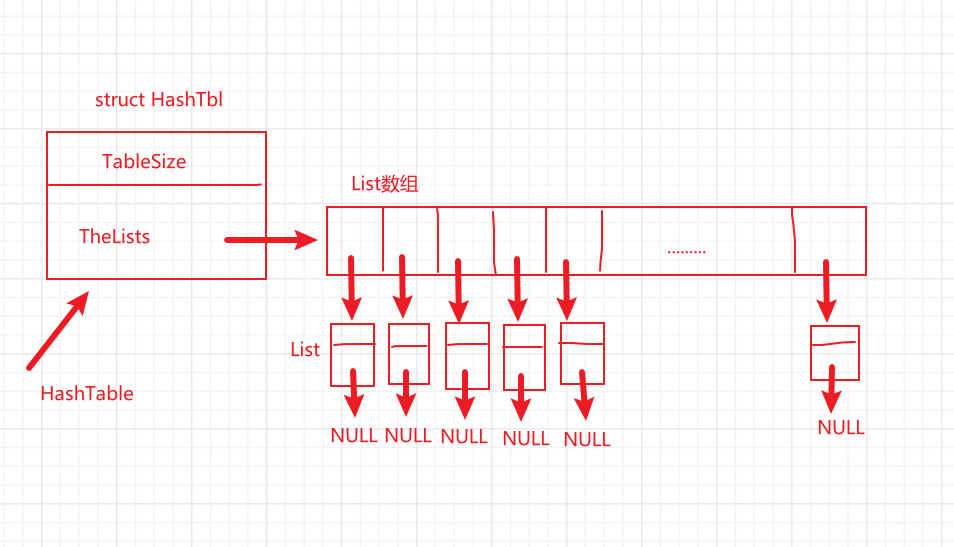

## 散列表（离散链表法）

#### 1.相关介绍

散列表也叫哈希表，英文名字Hash Table,有具体的哈希函数，将值映射到具体的表下标中。这样查找起来就十分方便。

##### 散列表的注意点：

(1)散列函数要具有**一致性**，一个值通过散列表的映射得到的值是不变的，相同的值每次映射都是相同的结果。

(2)散列表中存的值，要均匀；如果值都聚集在一个位置，那么这个散列表就是糟糕的！

(3)填装因子应该小于0.7

填装因子=散列表中元素值个数/散列表中的总位置

当填装因子大于0.7时，需要进行调整！在满足装填因子的情况下，散列表中总位置尽量取素数，取上素数，发生冲突的概率小，但并不代表不发生！

##### 哈希函数

==目前我对哈希函数的理解，哈希函数本质上还是一个函数，就是你输入一个值，通过这个函数映射一个哈希表的索引下标；你把值存到哈希表中的话，你再次查找或者操作时，直接通过这个哈希函数，就可以立马找到！！！==

==方便快捷，哈哈！！==

哈希函数1：输入参数1是字符串，参数2是散列表的大小

```c
//将字符串中的字符的ASCII码相加 
Index Hash1(char* Key,int TableSize)
{
	unsigned int HashVal=0;
	while(*Key!='\0')
	{
		HashVal+= *Key++;	
	}
	return HashVal%TableSize; 
} 
```

哈希函数2

```c
//u1s1，我不知道这是怎么想的 
Index Hash2(char* Key,int TableSize)
{
	return (Key[0]+Key[1]*27+Key[2]*729)%TableSize;
}
```

哈希函数3

```c
Index Hash3(char* Key,int TableSize)
{
	unsigned int HashVal=0;
	while(*Key!='\0')
	{
		HashVal=(HashVal<<5)+*Key++;	
	}
	return HashVal%TableSize;
}
```

#### 2.散列表数据结构定义(关键)

```c
#define MinTableSize (10)      //定义表的长度最小为10
typedef unsigned int Index;    //将unsigned int改名为Index 
typedef int ElementType;	   //将int改名为ElementType	
struct ListNode{               //链表结构体定义，首先是数值，其次是指向下一个节点的指针
	ElementType Element;
	struct ListNode* Next;
};

typedef  struct ListNode* Position;     //专门指链表的节点
typedef Position List;                  //专门指的是链表
 
struct HashTbl{                         //哈希表的结构体定义
	int TableSize;                      //哈希表的尺寸
	List* TheLists;                     //相当于链表数组
};

typedef struct HashTbl* HashTable;//这是正儿八经的哈希表 

```

==数据结构图示：==



#### 3.散列表的相关操作

##### 1.辅助函数：寻找一个最接近N的素数（大于等于N）

```c
bool IsPrime(int n);
//参数N，返回一个大于等于N的素数
int NextPrime(int N)
{
	while(!IsPrime(N))
	{
		N++;	
	}
	return N;	
}


//判断一个数是否是素数
bool IsPrime(int n)
{
	for(int i=2;i*i<n;i++)
	{
		if(n%i==0)
		{
			return false;	
		}	
	}
	return true;	
}
```

这个函数还让我回忆了一波，如何判断一个数是否为素数！

简单说一下：（1）时间复杂度为O(N)的定义判断法（2）时间复杂度为O(N^1/2)的优化方法，如上代码所示！！

##### 2.对于输入数值，最简单的哈希函数设定

```c
//很简单的Hash函数
Index Hash(ElementType Key,int TableSize)
{
	return Key%TableSize;
}
```

##### 3.初始化哈希表

这个的关键便是：要清楚哈希表的数据结构构造。

首先，哈希表结构体包含哈希表长度和链表数组。链表数组中的每一个都是一个链表。

```c
HashTable InitTable(int TableSize)
{
	HashTable H=(struct HashTbl*)malloc(sizeof(struct HashTbl));
	//想给哈希表搞一个素数长度了
	H->TableSize=NextPrime(TableSize);//在你定的哈希表长度的基础上，找一个最接近的素数值
	//开辟一个链表数组
	H->TheLists=(List*)malloc(sizeof(struct ListNode)*H->TableSize);		
	//给链表数组挨个开辟头结点空间 
	for(int i=0;i<H->TableSize;i++)
	{
		H->TheLists[i]=(List)malloc(sizeof(struct ListNode));
		H->TheLists[i]->Next=NULL;
	}	
	return H;
}  
```

##### 4.在哈希表中查找一个值的节点位置

```c
//在哈希表中寻找一个值所在的节点位置
Position Find(ElementType X,HashTable &H)
{
	List L=H->TheLists[Hash(X,H->TableSize)];//先找到值所在的链表数组索引，然后找到对应的链表
	Position p=L->Next;
	while(p!=NULL)
	{
		if(p->Element!=X)
		{
			p=p->Next;	
		}	
	}
	return p;	
} 
```

思路so easy!先通过哈希表寻找链表数组，在链表数组的每个元素（链表）中，依次遍历每一个链表节点，寻找这个值！

##### 5.将值插入到哈希表中

思路：先将该值放入设定好的Hash函数中，求出这个值对应在Hash表中的索引，然后在链表数组中找到这个链表，再在这个链表的表头进行插入，OK！

```c
//将一个值插入到哈希表中
//思路其实没个啥，其实就是给一个值，通过哈希函数映射到对应的链表数组索引，然后在对应的链表中进行表头插入
void Insert(ElementType X,HashTable H)
{

	Position p=Find(X,H);
	//如果存在，就不用管了
	//如果不存在，就在对应的表头进行插入
	Position NewCell;
	if(p==NULL)
	{
		List L=H->TheLists[Hash(X,H->TableSize)]; 
		NewCell=(struct ListNode*)malloc(sizeof(struct ListNode));
		NewCell->Element=X;
		NewCell->Next=L->Next;
		L->Next=NewCell;
	}	
} 
```

##### 6.销毁哈希表

思路：先依次销毁链表数组中的各个链表，然后销毁链表数组名，最后销毁哈希表！

```c
//销毁表
void  DestroyTable(HashTable H)
{
	Position p;
	for(int i=0;i<H->TableSize;i++)
	{
		p=H->TheLists[i];  //瞎想，沿着这条链子，只要能找到各个节点就能删除了 
		while(p!=NULL)
		{
			Position term=p->Next;
			free(p);
			p=term;
		}
	}
	free(H->TheLists);
	free(H);	
} 
```

