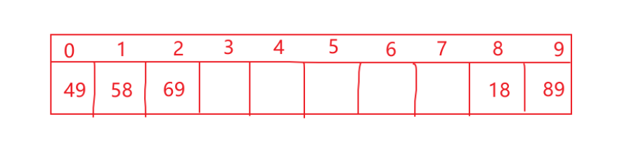
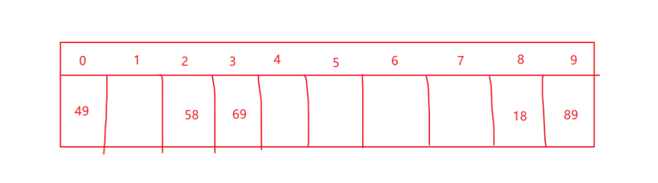
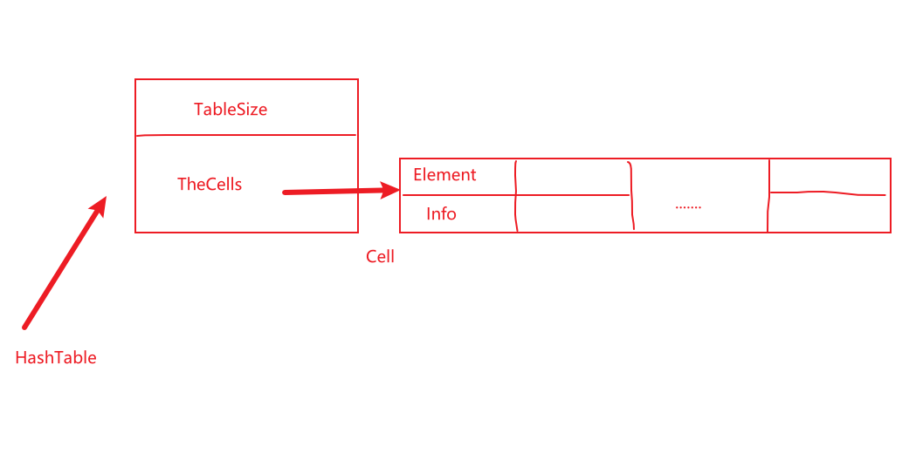

### 散列表（开放定址法）

#### 1.线性探测法

将具体的值输入到哈希函数中，映射出的具体的哈希表中的下标索引。当下标索引冲突时。

离散链表法：将重复了的值用链表的方式挂在对应索引的链表下。

线性探测法：一个位置只放一个值，如果发生冲突，接着寻找下一个没有放值的地方。

##### 举个栗子：

哈希函数：Hash(X)=X   mod  10

解决冲突的方法：F（i）=i

当发生冲突时:单元h0(X) , h1(X) ,h2(X)....相继试选

hi(X)=(Hash(X)+F(i))   mod  Tablesize,且F（0）=0


将{89,18,49,58,69}插入一个散列表，散列函数为：

Hash(X)=X   mod  10



#### 2.平方探测法

平方探测法来解决冲突，和线性探测法的不同是解决冲突的函数；线性探测法是F(i)=i，是线性函数！

平方探测法是F(i)=i^2,是平方函数！！

将{89,18,49,58,69}插入一个散列表，散列函数为：

Hash(X)=X   mod  10



#### 3.数据结构定义

```c
#define MinTableSize (10)    //哈希表最小表长为10
typedef int ElementType;     //将int改名为ElementType
typedef unsigned int Index;  //将unsigned int改名为Index
typedef Index Position;      //将Index改名为Position 
//枚举类型，有三种状态
enum KindOfEntry {
	Legitimate,Empty,Deleted
}; 

//表中每一个格子的结构
struct HashEntry
{
	ElementType Element;   //存储元素值
	enum KindOfEntry Info; //这个单元格的状态
};

typedef struct HashEntry Cell;   //将struct HashEntry改名为Cell
struct HashTbl{                  //哈希表的结构体
	int TableSize;               //哈希表表长
	Cell* TheCells;              //Cell类型的数组
};

typedef struct HashTbl* HashTable;  //哈希表
```



#### 4.相关操作

##### （1）辅助函数：时间复杂度为O（N^1/2）的素数判断法，不多赘述，太简单！

```c
bool IsPrime(int N);
//找一个和N最接近的素数
int NextPrime(int N)
{
	while(!IsPrime(N))
	{
		N++;	
	}
	return N;	
} 


//判断是不是素数
bool IsPrime(int N)
{
	for(int i=2;i*i<N;i++)
	{
		if(N%i==0)
		{
			return false;//不是素数	
		}	
	}
	return true;//是素数	
} 
```

##### （2）简单的哈希函数设定

```c
//哈希函数的简单设置
Index Hash(ElementType Key,int TableSize)
{
	return Key%TableSize;
} 
```

##### （3）哈希表的初始化

因为这次使用的是开放定值法，所以哈希表数据结构和离散链表法不同。初始化，首先开辟一块空间，结构中包含哈希表长度和一个指向结构体的指针（相当于开辟一个结构体数组）。然后使用辅助函数来确定一个素数，来充当哈希表的表长，之后开辟结构体数组。最后初始化结构体数组中的状态全为Empty!!!

```C
//哈希表的初始化
HashTable InitTable(int TableSize)
{
	if(TableSize<MinTableSize)
	{
		printf("哈希表长太短了，不行！！");
		return 	NULL;
	}
	HashTable H=(struct HashTbl*)malloc(sizeof(struct HashTbl));
	//想给哈希表整一个素数表长，这样不易产生冲突
	H->TableSize=NextPrime(TableSize);//结构体指针类型 
	//开辟结构体数组 
	H->TheCells=(Cell*)malloc(sizeof(struct HashEntry)*H->TableSize);
	//初始化结构体数组
	for(int i=0;i<H->TableSize;i++)
	{
		H->TheCells[i].Info=Empty;
	}
	return H;	
}
```

##### (4)在哈希表中给输入值寻找存放位置

思路：首先用已经给定的哈希函数，得到该值对应的数组索引下标。然后在哈希表中去查找，如果这个值已经被占了而且值与输入值不等，那么就通过冲突函数，重新确定索引下标位置。否则就返回该位置就OK（包含，这个位置没有被占和占了但是值相等！）

```c
//返回可以存放数值的位置
Position Find(ElementType X,HashTable H)
{
	Position p=Hash(X,H->TableSize);
	int CollisionNum=0;
	while(H->TheCells[p].Info!=Empty&&H->TheCells[p].Element!=X)
	{
		p+=2*(++CollisionNum)-1;
		if(p>=H->TableSize)
		{
			p=p-H->TableSize;	
		}	
	}
	return p;	
}
```

##### （5）将值插入哈希表中

思路：先通过上面的Find函数，找到空位置，然后将值放到对应位置，并且设定该位置为Legitimate。

```c
//在哈希表中插入值
void Insert(ElementType X,HashTable &H)
{
	Position p=Find(X,H);
	H->TheCells[p].Element=X;
	H->TheCells[p].Info=Legitimate;
}
```

##### （6）重构哈希表

当填装因子达到一定值时，就应该重新构造一个哈希表以使用！重构哈希表，首先用变量将原来表中的数据保留下俩，其次在原来表的基础上重新初始化表（设定新的表长），然后将旧表中数据重新插入新表中。最后释放旧表空间就OK！

```c
//重构一个哈希表, 重构的意思是，在原来的基础上进行！！！ 
HashTable ReHash(HashTable H)
{
	int OldSize=H->TableSize;
	Cell* OldCell=H->TheCells;
	
	H=InitTable(OldSize*2);
	//将原来的元素搬过来
	for(int i=0;i<OldSize;i++)
	{
		if(OldCell[i].Info==Legitimate)
		{
			Insert(OldCell[i].Element,H);	
		}	
	}
	free(OldCell);
	return H; 
	 				
} 
```

##### （7）获取表中具体位置元素，太简单了！

```C
//获取一个位置的值 
ElementType Retrieve(Position p,HashTable H)
{
	return H->TheCells[p].Element; 
}
```

##### （8）销毁哈希表

鉴于开放定值法的数据结构，先销毁指向Cell类型的指针，然后销毁指向哈希表的指针！

```c
//销毁这个哈希表
void DestroyTable(HashTable H)
{
	free(H->TheCells);
	free(H);	
} 
```

#### 5.总结

首先说，

哈希函数：哈希函数是自己设定的，用来将输入的值（将要存放的值）映射出一个哈希表的下标索引。

**其实就是一个索引转换器**，你输入你的值，它返回这个值应该存在哈希表的哪个位置！！

优点：

==相比一个普通的表，如果要查找一个值，那就要从头到尾遍历这个表，时间复杂度是O（表长），比较耗时！！！==

==用上哈希表，当你将一个值存入哈希表中，之后再进行查找，那么直接通过哈希函数映射对应的索引位置，只需要O（1）即可找到！！效率贼高！！==

存在的问题：

函数我们都知道，当我输入两个不同的变量，返回同一个函数值的情况，常常发生。当然，哈希函数也有可能发生这样的情况！！！我们称哈希表的这种情况叫做冲突！

那怎么办呢？

下面是解决冲突的两种方法：

（1）离散链表法：

什么意思？就是当不同的值对应同一个表的下标索引时，我们相当于在这个下标索引这儿，拉了一个链表。这样哈希表的同一个索引位置就可以“挂”好多个值了！！！

这样，当存进哈希表中，再次查找这个值时。先通过哈希函数找哈希表的索引，然后再在索引对应的那个链表中挨个查找即可！！！

（2）开放定址法：

开放定址法，我的理解是：当你输入一个值时，通过哈希函数转化出来的索引下标中，已经有值了。那么就是发生冲突了！你可以自己设定一个函数，来重新确定其值在哈希表中的索引位置。

1）线性探测法：冲突函数是线性的，从冲突位置，挨个去查找空的位置

2）平方探测法：冲突函数是二次方的，从冲突位置，隔1、4、9....个位置去找空位置

