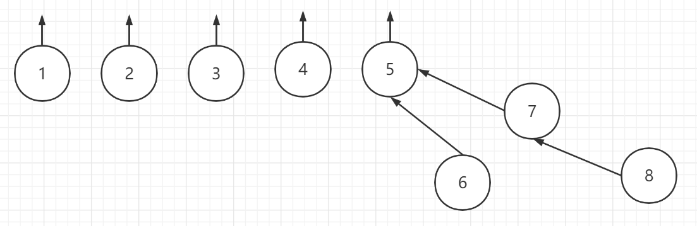
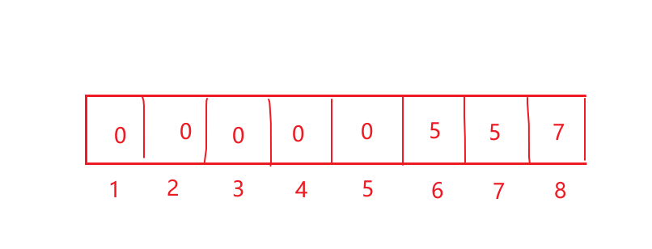

### 不相交集总结

#### 1.概念介绍

抽象的来讲，不相交集的数据结构用一个数组就完全可以实现。

具体起来理解，就是树的节点之间的链接。

关键操作有两个：==查找和合并==

用一个数组（一张表）来表示树的根节点之间的链接关系，如下图所示：





**解释：下标代表其值，而下标对应的数组中对应的该节点的父节点值。当父节点值是0时，表示这个节点就是根节点。**

#### 2.具体操作

##### （1）初始化

```c
//初始化
void Initialize(DisjSet S)
{
	for(int i=NumSets;i>0;i--)
	{
		S[i]=0;	
	}	
} 
```

将数组所有值都初始化为0

##### （2）合并---------合并两棵树

```c
//合并
void SetUnion(DisjSet S,SetType Root1,SetType Root2)
{
	//将Root2挂到Root1下面，说明Root1是父节点 
	S[Root2]=Root1;
		
} 
```

将树Root2挂到Root1下面，将Root2对应的数组值置为Root1。

##### （3）寻找一个节点所在的树根

```c
//找一个值的节点，对应的父节点 
SetType Find(ElementType X,DisjSet S)
{	
	if(S[X]<=0)
	{
		return X;	
	}
	else
	{
		Find(S[X],S);	
	}	
} 
```

这是一个递归的过程，递归得去找一个节点的父节点。递归结束条件是：节点（索引）对应值<=0时。

##### （4）合并的优化

```c
//合并时的优化（深度小的挂在深度大的下面） 
void SetUnion1(DisjSet S,SetType Root1,SetType Root2)
{
	if(S[Root1]<S[Root2])
	{
		S[Root2]=Root1;	
	}
	else
	{
		if(S[Root1]==S[Root2])
		{
			S[Root1]--;//将其--,其实就是将其深度加深	
		}	
		S[Root1]=Root2; 
	} 
}
```

之前的合并算法，有这样的缺点。无论是什么情况下，都是树Root2合并到Root1下。会导致树的深度加深。寻找节点对应的根时，开销太大！！！

现在优化的策略是：在合并两棵树时，判断一下两棵树的深度。将深度较小的树挂到深度较大树上。

如果两棵树的深度相等，那么将Root2挂在Root1下面。

##### （5）寻找的优化

```c
/*
路径压缩：实质上就是改变找到的节点的父节点，将其直接指向根节点 
*/ 
SetType Find1(ElementType X,DisjSet S)
{
	if(S[X]<=0)
	{
		return X;	
	}
	else
	{
		return S[X]=Find(S[X],S);	
	}	
} 
```

在递归寻找一个节点对应的根时，递归地将此路径上的节点都直接连在跟节点上。