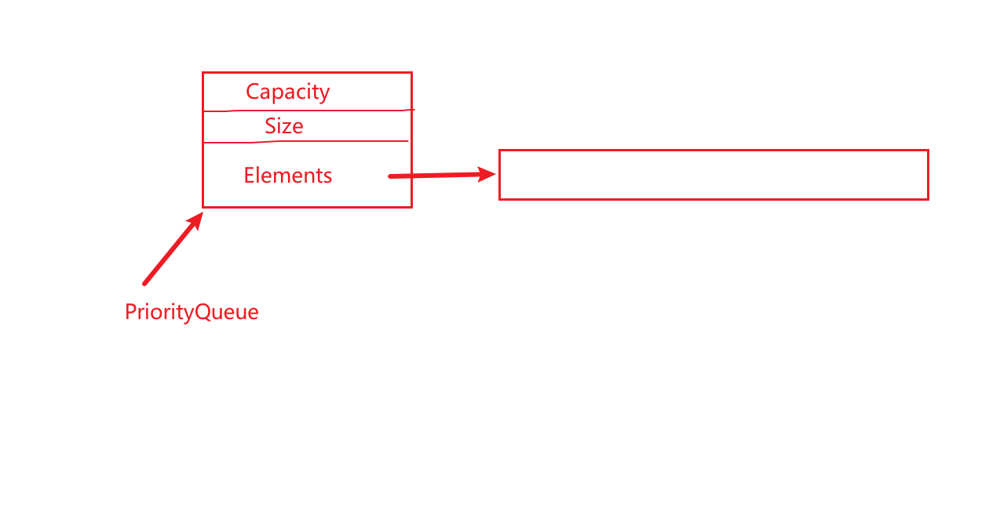

### 二叉堆

举个例子引入优先队列的概念：

当去银行换钱，为了使整体等待时间最少，应该先让耗时少的人优先办理。而不是像普通队列一样，正常排队，FIFO。

#### 1.具体使用的数据结构

二叉堆：其实就是完全二叉树。

对于每一个子树来说，其根是最小的，称为小根堆。其根是最大的，称为是大根堆！

上滤操作：用在插入节点时。

当插入节点时，先将节点插在二叉堆的最末尾，然后从下往上比较，直到整个堆满足二叉堆特性为止！

下滤操作：用在删除节点时。

当删除节点时，将最后一个节点断开连接，然后从被删除节点开始，从上往下进行比较，交换！最后将空出来的节点中填上原来断开的最后一个节点值。至此，整个堆满足二叉堆的特性，OK！！

#### 2.数据结构的定义

```c
#define MinPQSize(10)
#define MinData(-32767)

struct HeapStruct{
	int Capacity;    //总共的容量 
	int Size;        //当前所用掉的容量 
	ElementType* Elements; //一片存储空间的起始地址 
};

typedef int ElementType;
typedef struct HeapStruct* PriorityQueue;
```



#### 3.关键操作

（1）初始化优先队列

```c
//初始化一个优先队列
PriorityQueue Initialize(int MaxSize)
{
	if(MaxSize<MinPQSize)
	{
		printf("队列长度也太短了吧！！！\n");
	}
	PriorityQueue H=(PriorityQueue)malloc(sizeof(struct HeapStruct));
	H->Capacity=MaxSize;  
	H->Size=0;//当前里面存放了0个元素
	H->Elements=(ElementType*)malloc(sizeof(ElementType)*(MaxSize+1));//加一的原因是，需要将数组索引为0的位置空出来，充当哨兵
	//将数组中的哨兵值设定为MinData
	H->Elements[0]=MinData;
	return H;	
} 
```


思路：了解了它的数据结构之后，再初始化就简单多了！！先开辟一个空间指向PriorityQueue，然后设置优先队列的容量，然后设置当前使用了几个。然后开辟一个数组，并设置哨兵值为MinData。

（2）优先队列中插入值（上滤操作）

```c
//在优先队列中插入一个值（上滤操作）
void Insert(ElementType X,PriorityQueue H)
{
	if(IsFull(H))
	{
		printf("队列已经满了，插不进去了！！\n");
		return;	
	}
	int i;
	for(i=++H->Size;X<H->Elements[i/2];i=i/2)
	{ 
		H->Elements[i]=H->Elements[i/2];		
	}
	H->Elements[i]=X;	 //最后将其放在合适位置 
} 
```

思路：先判断优先队列是不是满的，如果满了，就插入不了！然后先将要插入的值挂到当前优先队列的下一个元素位置，然后向上判断，如果其小于其父节点，就将父节点的值移下来，直到不满足条件为止。最后将插入的值放在i的位置！！

（3）删除最小值（优先队列出队操作）---------------下滤操作

```c
//删除最小值，并且返回它
ElementType DeleteMin(PriorityQueue H)
{
	if(IsEmpty(H))
	{
		printf("队列为空，无法进行删除!\n");
		return 	MinData;
	}
	int Min=H->Elements[1];
	int Last=H->Elements[H->Size];
	H->Size--;//删除之后，缩小其大小
	int child;
	int i;
	for(i=1;i*2<=H->Size;i=child) 
	{
		child=i*2;
		if(child!=H->Size&&H->Elements[child+1]<H->Elements[child])
		{
			child++;	
		}
		if(Last>H->Elements[child])
		{
			H->Elements[i]=H->Elements[child];						
		}
		else
		{
			break;
		}
	}
	H->Elements[i]=Last;
	return Min;	
}
```

思路：如果整个优先队列为空，那么就不能删除！从堆顶位置开始，从其左孩子和右孩子中找一个较小的值。然后判断它是否小于Last值。如果小于，就能将较小的孩子值去替代i的位置。如果不满足时，就跳出循环。让最后一个值替代i的位置。

