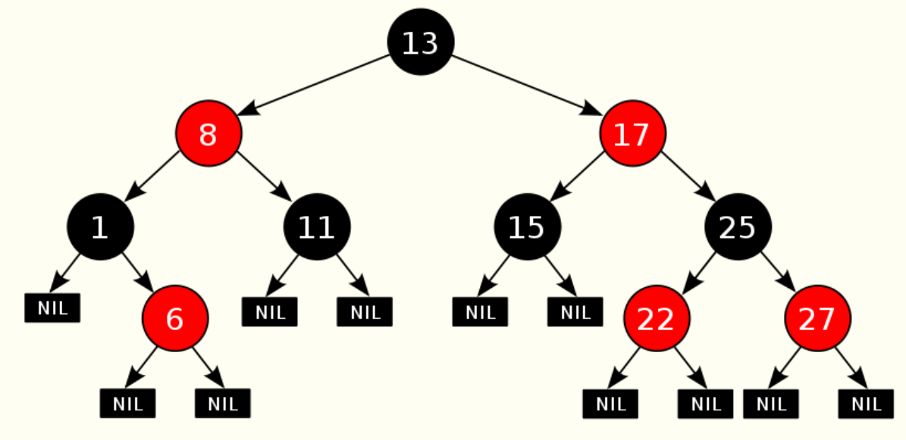

# RBTree

## 红黑树简介

红黑树，一种二叉查找树，但在每个结点上增加一个存储位表示结点的颜色，可以是Red或Black。 通过对任何一条从根到叶子的路径上各个结点着色方式的限制，红黑树确保没有一条路径会比其他路径长出俩倍，因而是接近平衡的。

红黑树虽然本质上是一棵二叉查找树，但它在二叉查找树的基础上增加了着色和相关的性质使得红黑树相对平衡，从而保证了红黑树的查找、插入、删除的时间复杂度最坏为O(log n)。

## 红黑树的性质：

红黑树是具有下列着色性质的二叉查找树:

1.每一个节点或者着红色,或者着黑色。

2.根是黑色的。

3.如果一个节点是红色的,那么它的子节点必须是黑色的。

4.从一个节点到一个 NULL指针的每一条路径必须包含相同数目的黑色节点。

## 自底向上插入：

新项作为树叶放入，该项必须为红，如果父节点为黑，则插入成功，如父节点为红，通过改变颜色或旋转完成操作。

## 自顶向下红黑树

涂色时可以朝根的方向上滤，直到不再有2个相连的红色节点或到达根为止。上滤实现需要用一个栈或父指针保存路径，若使用自顶向下，保证插入节点的父节点的兄弟节点不是红的，令伸展树更有效。